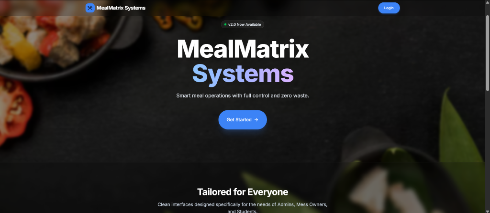

# 🍱 Meal Matrix Smart Food Management System

An advanced, smart food management platform featuring QR-based attendance automation, real-time analytics dashboards, secure authentication, and a scalable architecture.


🚀 **Live Deployment:** [https://meal-matrix-smart-food-management-s.vercel.app/](https://meal-matrix-smart-food-management-s.vercel.app/)



---

## ✨ Key Features

- 📱 **Dynamic QR Code Attendance:** Secure, real-time QR generation and scanning for automated student meal attendance.
- 📊 **Real-Time Analytics & Admin Dashboards:** Comprehensive analytics for administrators to track bookings, consumption patterns, and hostel capacity.
- 🔒 **Secure Role-Based Authentication:** JWT auth with granular permissions for Students, Owners, and Administrators.
- 🎨 **State-of-the-Art UI/UX:** Responsive, dark-mode ready interface built with Next.js, React, Lucide Icons, and Tailwind CSS.
- 🛠️ **System Verification & Soft Locks:** Built-in safeguards against duplicate check-ins and session expirations.

---

## 🛠️ Tech Stack

- **Frontend:** Next.js, React, Tailwind CSS, Lucide Icons
- **Backend Services:** Node.js, Express, Vercel Serverless Functions
- **Deployment:** Vercel

---

## 🚀 Quick Start (Local Setup)

```bash
# Clone the repository
git clone https://github.com/Madhuritgithub/MealMatrix_Smart_Food_Management_System.git

# Navigate into project directory
cd MealMatrix_Smart_Food_Management_System

# Install dependencies
npm install

# Run development server
npm run dev
```

Open [http://localhost:3000](http://localhost:3000) in your browser.

---

## 🌐 Live Application Link

Experience the live system here: **[https://meal-matrix-smart-food-management-s.vercel.app/](https://meal-matrix-smart-food-management-s.vercel.app/)**
